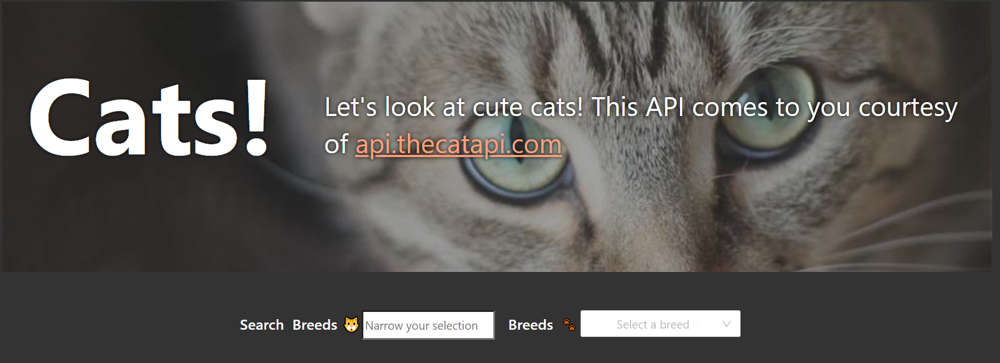
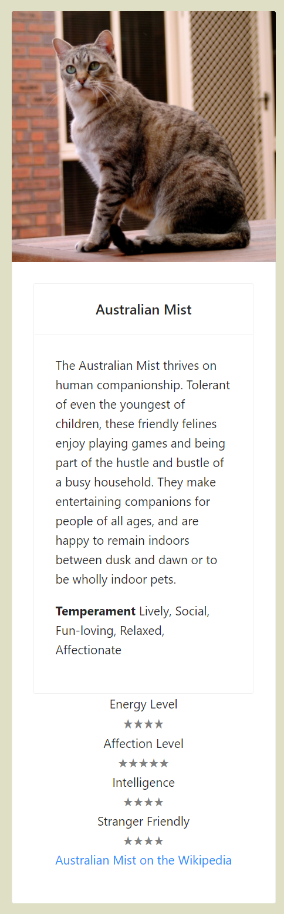

# Getting Started with Create React App
This project was bootstrapped with [Create React App](https://github.com/facebook/create-react-app). The `CRA` portions are abbreviated to only what a user would need to run for evaluation.

## Available Scripts
In the project directory, you can run:

### `yarn start`
Runs the app in the development mode.\
Open [http://localhost:3000](http://localhost:3000) to view it in the browser.

### `yarn test`
Launches the test runner in the interactive watch mode.\
See the section about [running tests](https://facebook.github.io/create-react-app/docs/running-tests) for more information.

# Cats!

This little app is dervived from a similiar API exercise with the Dogs CEO API at https://dog.ceo/api/breeds/list/all. They both have a similiar mission to bring you gratuitously cute images of our favorite furballs to our home screens.

While adapting the dog-api software to utilize the api.thecapapi.com interface, much of the main page, BreedIndex.jsx was changed. I extracted the API key and URLs to an .env file which, against common practice is not recommended for public repositories (and solely included it for the duration that you will need for evaluation). It will self destruct once your assessment is complete!
## Brief Structure Overview
I destructured some of the components for manageability, seperation of concerns and strived for task-specific functional components. I tend to utilize functional components coupled with useState, useEffect and useCallback hooks instead of class components because I find functional components easier to test.

### App.jsx/BreedIndex.jsx
The Dog API used a router to view "sub breeds" that the Cat API did require. There is essentially an extra layer with the App.tsx container that I striped the routing from, but left for future enhancements (discussed below). The bulk of the Main page is located in BreedIndex.jsx. This performs the initial call to the API to retrieve the available cat breeds in their database. There is one fetch that retrieves the API once and persists it with a useState variable. The API is not continuously updated, so a single fetch is appropriate for this application. 

### BreedList.jsx
This component is essentially the layout container and in playing around further with this app, I may rename it to indicate that more clearly. It displays the header and footer sections and the display state of the main sections. The main section conditionally renders:
* A matrix of Cat Cards the display pertinent inforation about each cat in the database.
* A masonary grid displays random images of a selected breed contingent apon the user specification of a breed. More on this excitment in the `BreedFormFilter.jsx` section below.
* Any error messages derived from the API interaction.
* A message indicating if no cats are found via the API and filtering parameters.
* A total record count of the number of cat breeds that were fetched. This was preliminary in adding pagination to the app which I would also add given more time. Because the API currently contains 67 types of critters, I gave the pagination a lower priority. Utilizing antd offered me a slick pagination widget, but alas did not have the bandwidth this go-round.

### BreedFormFilter.jsx
The filters located under the header section allow a user to use a string search of the breeds which feeds the select dropdown, the second filter for the app. The filtering is done by initially searching the original breed list and matching the search query being included anywhere in the breed.name property.

The user has 2 ways to select a breed - via the filtered (or unfiltered!) select dropdown or clicking the image on the Breed image on the BreedCard shown in the main area.

The search bar and its associated debouncer hook is also a 3rd party component with the search bar component customized for this application (I included the placeholder and customize the emoji label addon which I made aria compliant).
### BreedCard.jsx
This card contains valable information on each breed supported. We can get a quick overview of the breed's:
* Name
* A brief description
* Temperament
* Affection level
* Intelligence
* If they are friendly with stangers
* A link to their wiki page

There are many more properties that are given via the API, but I picked these as the most interesting. Given more time, I would add a few more bits of information to the card maybe including a small flag for the country of origin, and some icons indicating if they are exotic, hypoallergenic, a lap kitty, dog friendly, and other factoids!

Many of these characteristics are rated 0-5 as I've indicated with the star rating widget. This was a yarn package that I downloaded in leau of the rating widget that antd supplies. I was getting a invalid DOM nesting warning with the antd widget included, which, as it turns out was due to the way I included it in the Card component. I liked the yarn tar rtaing component better, so stuck with that even though it did introduce another (albeit small) package.

### CatBreedFever.jsx
The main section offers random pictures of the selected breed via a 3rd party yarn component. I set a % width, along with min/max values and relevent break points on the widget attributes for the random images and let the react-responsive-masonry widget work its masonary magic. The jsx also makes the breed specific fetch and generates an array of jsx image tag for each image returned from the API.

### Further development
As outlined above, current plans for the future are:

1. Move the BreedIndex into the App component to reduce the number of containers
2. Utilize the general useFetch hook and generalize it to receive the useState hooks to load the responses
3. Implement the pagination for the breed card listings
4. Spice up the BreedCards to include more information, make them look less boring and add a hover effect on the breed images so the it intuitive that they are clickable
5. Implement the rating feature on the Cards so users can vote on the various characteristics
6. The API offers an upload option so that a user can upload their own photos. A form could allow them to also add additional information about the cat and any image specifics.
7. Convert to Typescript for all the components.
8. Run the app through the aXe chrome addon to test for accessibility
9. Optimize the css to have it localized to the component rather than all co-located in the index.css file
8. Implement testing for all components.

Enjoy the felines!

